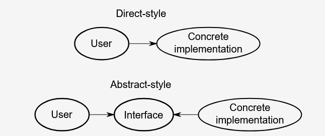
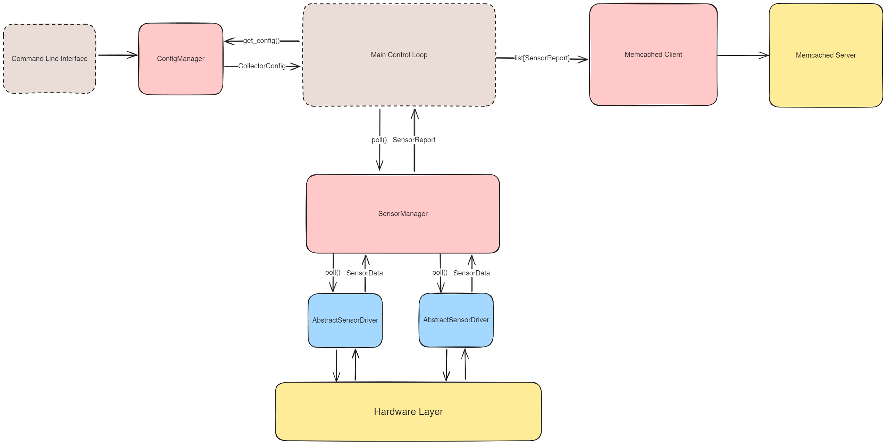
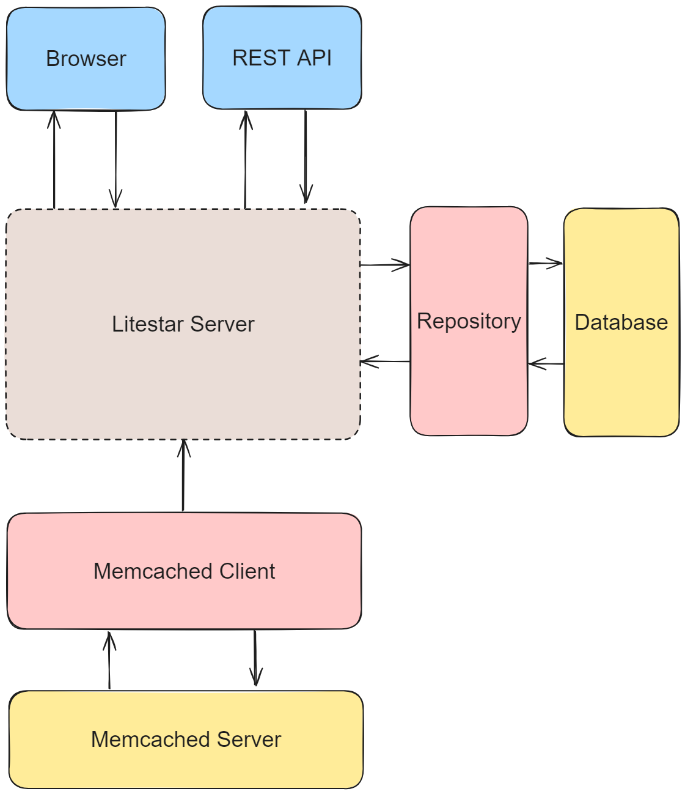

# Preliminary Software Design Document

This is the first software design document that is trying to establish what Python modules will be required and how they will interact with eachother. To start with, here is a brief overview of a principal used for design.

## Abstract Interfaces

In software engineering, an interface is a piece of code that contains only specification. For example, a function may define the arguments it accepts, the type of value it returns, and have a documentation string, but the actual workings of the function are left blank. The advantage of using interfaces is that it allows seperate pieces of software to be agnostic to specific implementations of the code they depend on, by making them depend on a contract instead. This allows changing those pieces independently. If one piece of the software changes, the changes required to make the rest of the system interact with the new logic should be as limited as possible to the location of the relevant change.

Abstract classes may be implemented with Python's `abc` (abstract base class) or `Protocol` types.

## Manager/Driver Design Pattern

The design pattern in use here can be called the Manager/Driver pattern. In this pattern, manager classes are responsible for implementing the main logic of the program, with the core control loop having access to all the manager classes it needs to acomplish its tasks, and deferring most of the logic to them. Manager classes focus more on high-level orchestration logic such as coordinating tasks whereas driver classes focus on low-level logic such as interfacing with hardware.

Manager classes may contain multiple driver classes which it uses to complete tasks. If required, the driver classes may be made to implement an abstract interface, such that the manager need not know the underlying workings of the driver. For example, the SensorManager class is what the main control loop of the program uses to retrieve sensor data. The SensorManager contains multiple SensorDriver classes, which each implement an AbstractSensorDriver interface. Because of this, if a new sensor is to be supported, this should not involve any changes to the SensorManager class, as it is only responsible for coordinating instances of classes which implement the AbstractSensorDriver interface. Therefore, only a new implementation of the AbstractSensorDriver interface would need to be created.

## Collector Node Design

This section goes over the software architecture of the collector node. A summary of this architecture is given in the following image.

### Classes

This section gives an overview of the components of the system.

#### Sensors

The `SensorManager` class is responsible for controlling each `SensorDriver` class it is connected to, and constructing a `CollectorReport` object. This will involve the following methods:
- `SensorManager.init()`: Given a `CollectorConfig` object, initializes a `SensorDriver` class for every sensor in the config. There will be a lookup table mapping types of sensor configurations to implementations of the `AbstractSensorDriver` interface which the `SensorManager` can use.
- `SensorManager.poll()`: Calls the `poll()` method on each of the underlying drivers, retrieving the data, catching any exceptions, and constructing a `CollectorReport` object to return to the main control loop.

The `AbstractSensorDriver` class is resposible for collecting data from the hardware and will contain the following methods:
- `SensorDriver.init()`: Given a `SensorConfig` object, initializes any underlying library with the configured values.
- `SensorDriver.poll()`: Calls the underlying sensor library to return a `SensorData` object.

#### Data Caching

This class will wrap an instance of the memcached client and allow the collector node to push data.

This class will simply have one method which stores any given data in the memcached client.
- `CacheManager.cache()`: Stores the data in-memory.

#### Configuration

The `ConfigManager` serves to make changes to the configuration file in a consistent way. If the configuration file is updated manually, there is no way to enforce constraints, such as GPIO pin numbers being correct.
- `ConfigManager.add_sensor()`: Adds a `SensorConfig` to the configuration file.
- `ConfigManager.update_sensor()`: Updates a `SensorConfig` in the configuration file.
- `ConfigManager.delete_sensor()`: Removes a `SensorConfig` from the configuration file.
- `ConfigManager.add_target()`: Adds a `TargetConfig` to the configuration file.
- `ConfigManager.update_target()`: Updates a `TargetConfig` in the configuration file.
- `ConfigManager.remove_target()`: Removes a `TargetConfig` from the configuration file.

### Data Structures

This section outlines the data structures that will need to be used and passed around the various components.

#### Sensor Data

These datastructures may utilize Python's dataclasses.

- `SensorData`: Generic data type for data returned by a sensor. May just be an alias for `Dict[str, Any]`.
- `CollectorRecord`: Contains a `SensorData`, the ID of the associated sensor, and a `datetime` timestamp.
- `CollectorError`: Contains an error code, an error message, the ID of the associated sensor, and a `datetime` timestamp.
- `CollectorReport`: Contains a list of `CollectorRecord`, a list of `CollectorError`, and the ID of the collector node.

#### Configuration Data

These datastructures may utilize the Pydantic library to make declarative validation easy. 

- `SensorConfig`: Contains an enumerated value describing the type of sensor, a sensor ID, and a dictionary containing any device-specific configuration values, such as GPIO pins and settings passed into the underlying sensor library.
- `TargetConfig`: Contains an ID of a storage node that data is to be sent to, and an endpoint where the data can be sent over the network.
- `CollectorConfig`: Contains a list of `SensorConfig`, a list of `TargetConfig`, and a collector node ID.

### Program Logic

#### Startup

Upon program startup, the main control loop does the following:
1. Instances of all required Manager classes are created.
2. The main control loop retrieves the device configuration by calling `ConfigManager.get_device_config()`. This configuration data contains all sensors that are currently configured on the device. For each sensor, the `SensorManager` initializes the corresponding `SensorDriver` class.

#### Polling

On an interval known as `POLLING_INTERVAL`, the following occurs:
1. The main control loop calls `SensorManager.poll()` which in turn calls `AbstractSensorDriver.poll()` on all the `SensorDrivers`. Each `SensorDriver` may return a `SensorData`, or it may raise an exception if an error has occurred. If it raises an exception, the `SensorManager` catches it and creates a `CollectorError` object. If it returns data, the `SensorManager` creates a `CollectorRecord`.
2. The `SensorManager` creater a `CollectorReport` object with the `CollectorRecord` and `CollectorError` objects, and populates it with the list of target storage node IDs that the device is to send data to. This is to allow the device to keep track of which of its targets it has sent data to, in the case that data is attempted to be sent when some connections are offline.
3. Finally, the `SensorManager` returns the `CollectorReport` object to the main control loop, which then calls `CacheManager.cache()` which stores the data in-memory.

## Storage Node Design

This section goes over the software architecture of the storage node. A summary of this architecture is given in the following image.

### Classes

This section gives an overview of the components of the system.

#### Memcached Client/Server

The Memcached server is what is connected to the network and collecting the data cached by all connected collector nodes. It is run in a seperate process to the main Litestar server. The Memcached client is a construct initialized on the Litestar server which interacts with the Memcached server and pulls data from it. Via a regular task, the Litestar server pulls data from the Memcached server where it then stores it into persistent storage.  

#### Repository/Database

The database is the persistent storage mechanism and may be a SQL database such as Postgres or a no-SQL database such as MongoDB. The Litestar server should be agnostic to the underlying database technology through the use of the Repository class, which converts between database constructs and native application datatypes such as `CollectorReport`.

#### Litestar Browser & REST Interface

The Litestar app exposes two types of routes: those which return HTML and make up the interactive browser based user-interface, and those which return JSON which make up the REST API.

The browser app may make use of templating libraries such as Jinja2 to construct the HTML to be sent to the browser. With this approach, the HTML page is sent upon every request to the server in the style of a multi-page-app, and a library such as HTMX can be used to surgically update HTML elements to provide page updates without refreshes. However, if more complicated behavior is required, a javascript framework which can compile to HTML and JS such as the Svelte framework may be used instead.

The REST API will implement the REST standards for API development and thus represent collector and sensor data as resources to be queried via GET requests.

Both the API and browser app will use session authentication. An admin user will be created upon initialization of the storage node, and this admin user may create more users through a configuration page, bypassing the need for user registration.