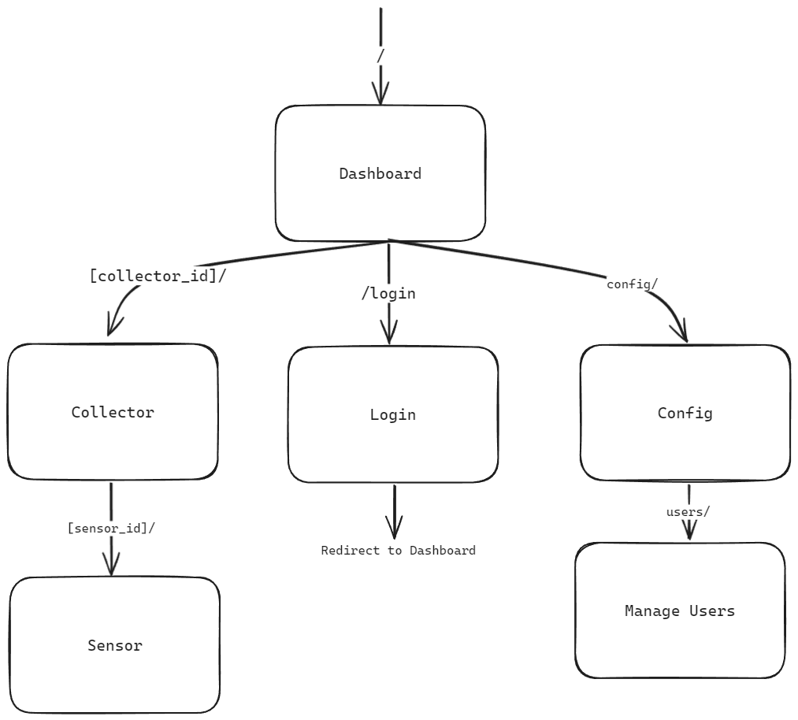
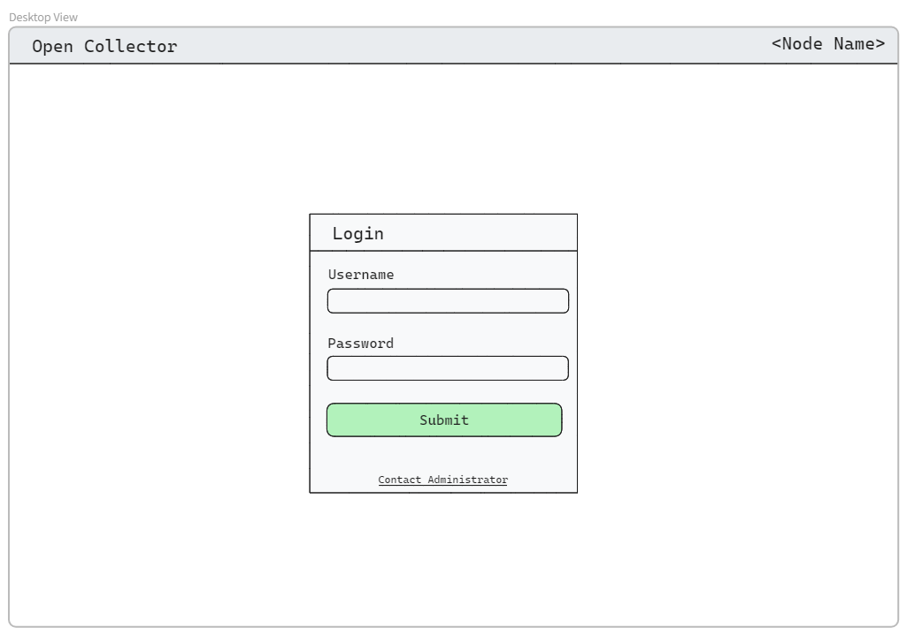
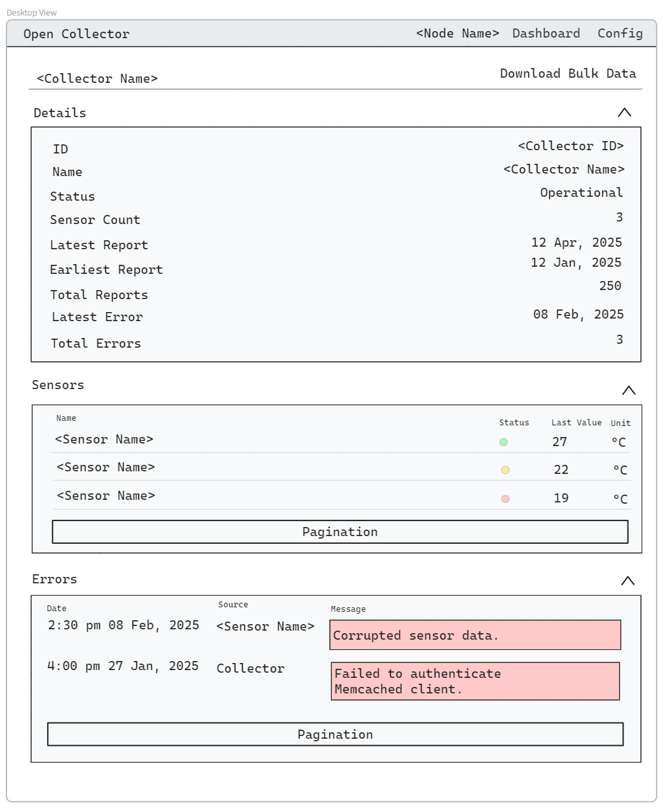
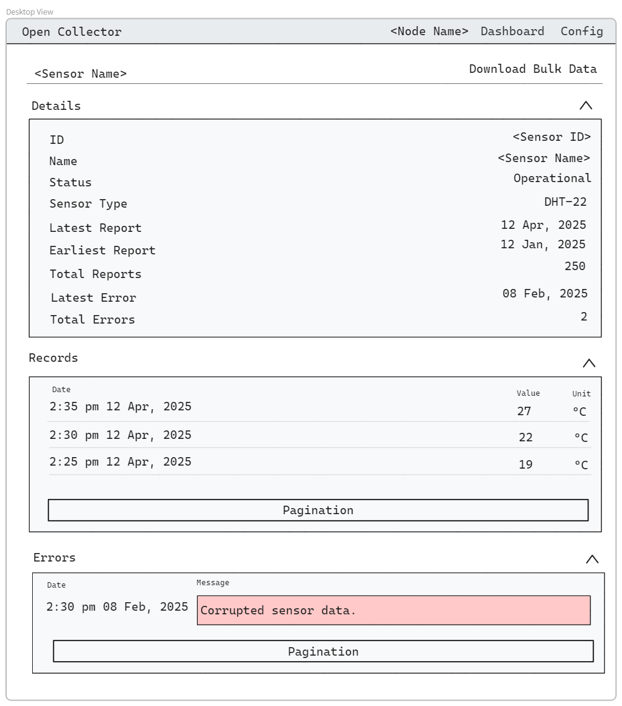

# User Interface Design

This document summarizes the wireframes that were made to draft the user interface.

The wireframes follow this hierarchical structure for accessing in the browser:

The dashboard provides quick access to all information and a graph:

The login page is used to authenticate the user. There is an admin user setup upon initialization of the storage node and more users can be configured by the admin user. If an unauthenticated user visits any page other than the login page, they are redirected to the login page. Upon successful login, the user is redirected to the login page.

Each collector has its own page, showing its details, sensors, and errors.

Each sensor has its own page, showing its details, records, and errors.

