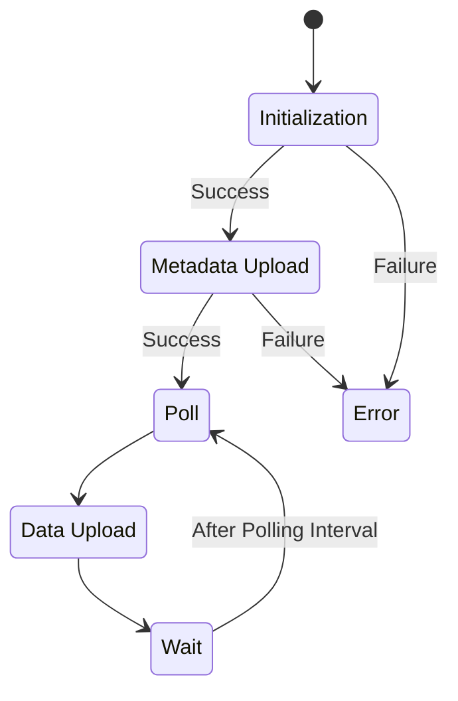
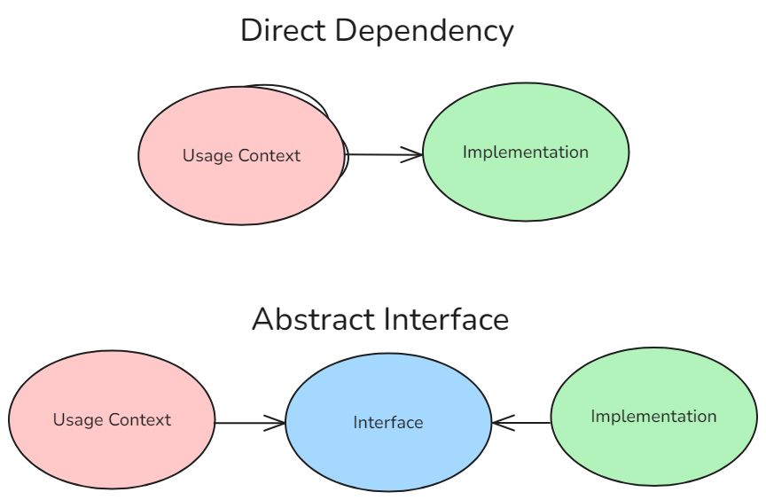

# Collector Development

The main goals of the collector code are as follows:

- Be flexible in supporting the addition of new types of sensors to the software.
- Provide enough configuration options to support all use cases without modifying the source code.
- Support Micropython.

## Architecture

The architecture of the collector code is visualized below and contains the following modules:

- **Main Control Loop** - This is the entrypoint of the program and is responsible for orchestrating the modules and the endless loop.
- **`ConfigManager`** - This class is responsible for parsing and validating the configuration contained within `config.json`.
- **`UploadManager`** - This class is responsible for formatting the collected data and uploading it via HTTP to the configured QuestDB endpoint.
- **Sensor Polling**:
    - **`SensorDriver`** - Each `SensorDriver` class instance is responsible for collecting data from a single sensor.
    - **`SensorManager`** - This class is responsible for initializing as many `SensorDriver` instances as are called for in the configuration, polling them, and sending the data to the main control loop.

### Main Control Loop

The main control loop has the following behavior:

1. Initializes all required manager classes.
2. Updates the metadata tables in the database with the currently collector and sensor configuration.
3. On an endless loop:
    1. Collects sensor data.
    2. Uploads sensor data.
    3. If the upload fails, logs the exception locally and proceeds to the next cycle; the failed report is not retried.
    4. Waits for the configured `polling_interval`, expressed in milliseconds.

### Config

For documentation on what the configuration values do, see the [User Guide](../../user-guide/collector/config.md).

See the [Config Reference](./reference/config.md) for documentation on the configuration-related source code.

### Upload

For documentation on the structure of the database, see the [Storage Database](../storage/database.md) page.

See the [Upload Reference](./reference/upload.md) for documentation on the upload-related source code.

### Sensors

For documentation on which sensors are currently supported and how to configure them, see the [User Guide](../../user-guide/collector/sensors.md) sensors page.

For instructions on how to add support for new sensors, see the [Sensor](./sensors.md) page.

See the [Sensor Reference](./reference/sensors.md) for documentation on the sensor-related source code.

#### Architecture & Approach

As the main goal of the sensor code design was to support adding more sensors in the future, the sensor code follows a manager-driver pattern, with the driver code fulfilling an abstract interface.

In software engineering, an interface is a piece of code that contains only specification. For example, a function may define the arguments it accepts, the type of value it returns, and have a documentation string explaining its behaviour, but the actual workings of the function are left blank. The advantage of using interfaces is that it allows seperate pieces of software to be agnostic to specific implementations of the code they depend on, by making them depend on a contract instead. This allows changing those pieces independently. If one piece of the software changes, the changes required to make the rest of the system interact with the new logic should be as limited as possible to the location of the relevant change.

In practice, this means that that the `SensorManger` class is not directly dependent on any specific implementation of a sensor but is instead dependent on an interface called `AbstractSensorDriver`. As long as the interface is properly designed, the changes to the codebase required to add new sensors to the software should be isolated to the creation of new implementations of the interface.

Abstract classes are be implemented with Python's `Protocol` type.

## Development

The collector is designed to run under both CPython and MicroPython. Packaging is automated, while deployment on physical hardware remains experimental and must be validated with the target sensors and firmware.

For development on a Raspberry Pi Pico W:

1. Flash a current Pico W MicroPython firmware image using the [Raspberry Pi documentation](https://www.raspberrypi.com/documentation/microcontrollers/micropython.html).
2. Copy `collector/src/config.example.json` to `collector/src/config.json` and replace the example IDs, network credentials, database address, GPIO assignments, and sensor settings.
3. Install `mpremote`, connect one board, and run `./scripts/flash_pico.sh collector/src/config.json` from the repository root.
4. Reset the board while a serial console is attached. Confirm initialization, metadata upload, repeated polling, and error reporting before disconnecting it.

Keep secrets and deployment-specific configuration out of version control. When changing collector code, test configuration parsing and sensor drivers under CPython first where practical, then repeat the test on real MicroPython hardware: module availability, filesystem paths, timing, and networking behavior differ between the runtimes.

The **Pico W package** workflow validates the canonical on-device layout without hardware. The manually dispatched **Pico W hardware-in-the-loop** workflow requires a self-hosted runner labelled `self-hosted`, `micropython`, and `pico-w`, plus a `PICO_CONFIG_JSON` repository secret. Record the MicroPython firmware version and attached sensor models with each physical test run.
