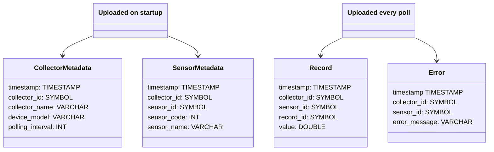

# Database Structure

```mermaid
classDiagram
    class UploadedOnStart["Uploaded on startup"]
    class UploadedOnPoll["Uploaded every poll"]

    UploadedOnStart --> CollectorMetadata
    UploadedOnStart --> SensorMetadata
    UploadedOnPoll --> Record
    UploadedOnPoll --> Error

    class CollectorMetadata {
        timestamp: TIMESTAMP
        collector_id: SYMBOL
        collector_name: VARCHAR
        device_model: VARCHAR
        polling_interval: INT
    }
    class SensorMetadata {
        timestamp: TIMESTAMP
        collector_id: SYMBOL
        sensor_id: SYMBOL
        sensor_code: INT
        sensor_name: VARCHAR
    }
    class Record {
        timestamp: TIMESTAMP
        collector_id: SYMBOL
        sensor_id: SYMBOL
        record_id: SYMBOL
        value: DOUBLE
    }
    class Error {
        timestamp TIMESTAMP
        collector_id: SYMBOL
        sensor_id: SYMBOL
        error_message: VARCHAR
    }
```