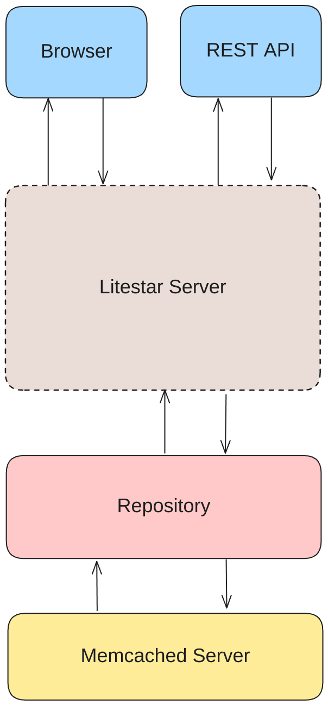

# Storage Development

The main goals of the storage code are as follows:

- Provide a simple UI for reading the data returned by the collector nodes.
- Be stateless, such that multiple storage nodes can access the same database.

## Architecture

The architecture of the storage code is visualized below and contains the following modules:

- **Litestar** - The API framework in use for serving the browser and API interfaces.
- **Database** - This section contains code for initializing the database connection, structuring the tables, and querying the data.
- **API** - This section uses the Litestar framework to expose the database queries over a REST API.
- **Browser** - This section uses the Litestar framework to serve a visual user interface to browsers which updates in realtime.  

### Litestar

See the [Litestar documentation](https://litestar.dev/) for information on the web server framework in use

### Database

The database 

### API

### Browser