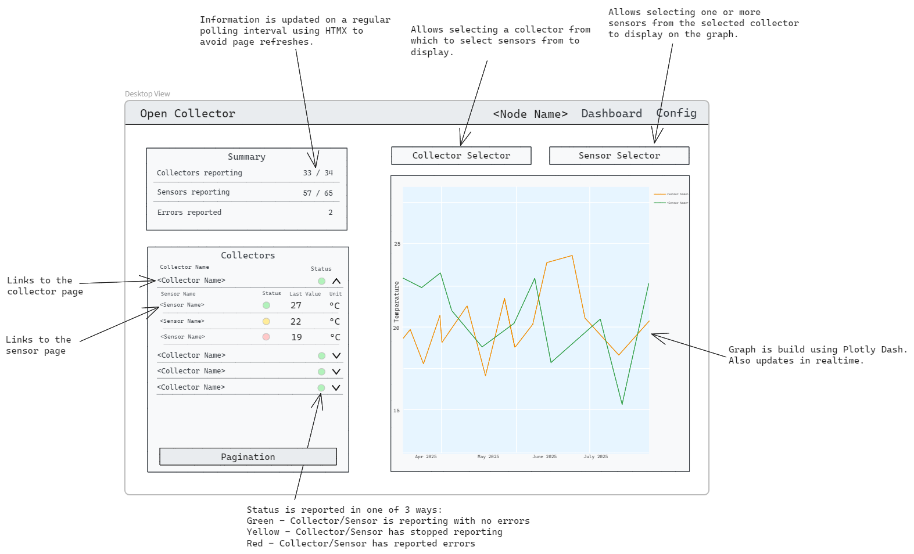

# Open Collector - Open Source Data Collection

*TODO: Replace this with a screenshot of the finished dashboard.*

OpenCollector is an open source Raspberry-Pi based data collection platform. Partnered with the [Simon Fraser University Computational Sustainability Lab](https://compsust.fas.sfu.ca/), this project is intended to create the foundation for a user-friendly IoT system that allows individuals and organizations to safely measure the impacts on their environment and monitor them for analysis and forecasting.

This prototype allows users to identify various parameters in their environment (such as temperature, light intensity, carbon dioxide) and tracks and displays the trends over time. This data is then securely stored in a cloud storage database to be able to access at a later date. While this prototype focuses on the use in a greenhouse, this project is intended for various uses.

The project encompasses the following parts:

- Python code for collecting data from multiple sensors and uploading it to a database.
- Python code for reading from a database and visually displaying data.
- A PCB for wiring up a Raspberry Pi Pico W to a temperature, humidity, particulate matter, light, and CO2 sensor.
- A 3D printable enclosure for securing the PCB.

See below for how to use this documentation:

- [Overview](./overview.md): Outlines key conceps and project structure.
- [User Guide](./user-guide/overview.md): Instructions for setting up and running the system.
- [Developer Guide](./developer-guide/overview.md): Technical details and design. 

