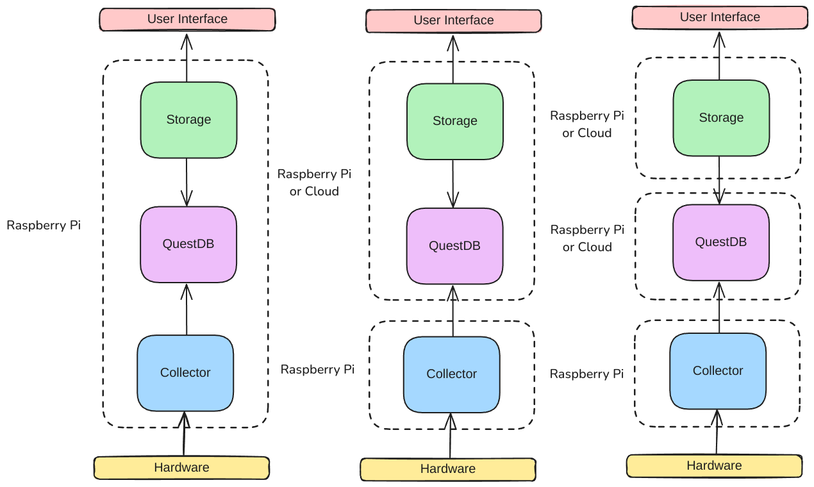
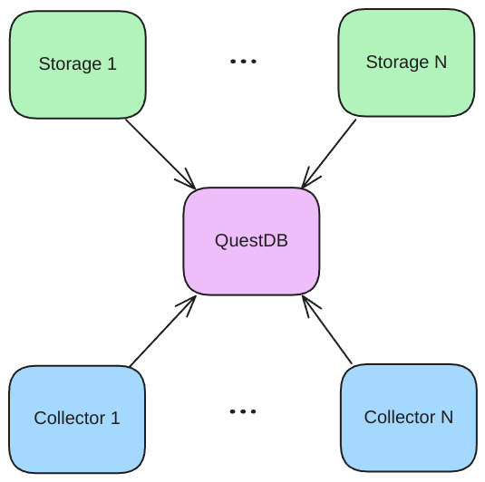

# System

The OpenCollector system contains two main modules:      

1. **Collector Nodes** are the edge devices responsible for collecting data from sensors and uploading it to the database.
2. **Storage Nodes** are the cloud devices responsible for reading data from the database and displaying it in a cloud platform.

Additionally, the following pieces are required for the OpenCollector system to work:

- **[QuestDB](https://questdb.com/)** is used as the open-source timeseries database and is the glue between the collector and storage nodes.

Given a machine that is compatible with hosting a webserver and connecting to sensors, these modules may be run on the same device. If desired, they can be run on seperate devices, with the storage node and database on the same device or different devices, and the collector node run on an edge device connected to sensors.

Nodes may be connected together under the following rules:

1. Collector nodes have a single QuestDB database as a target.
2. An unlimited number of collector nodes may send data to a single QuestDB database.
3. An unlimited number of storage nodes may read data from a single QuestDB database.

This allows for any number of collector nodes to be used with a single database. While multiple storage nodes can be connected to a single database, since their only purpose is to display data, there may not be an advantage to this. Currently, a collector node can only send data to one database at a time.

.