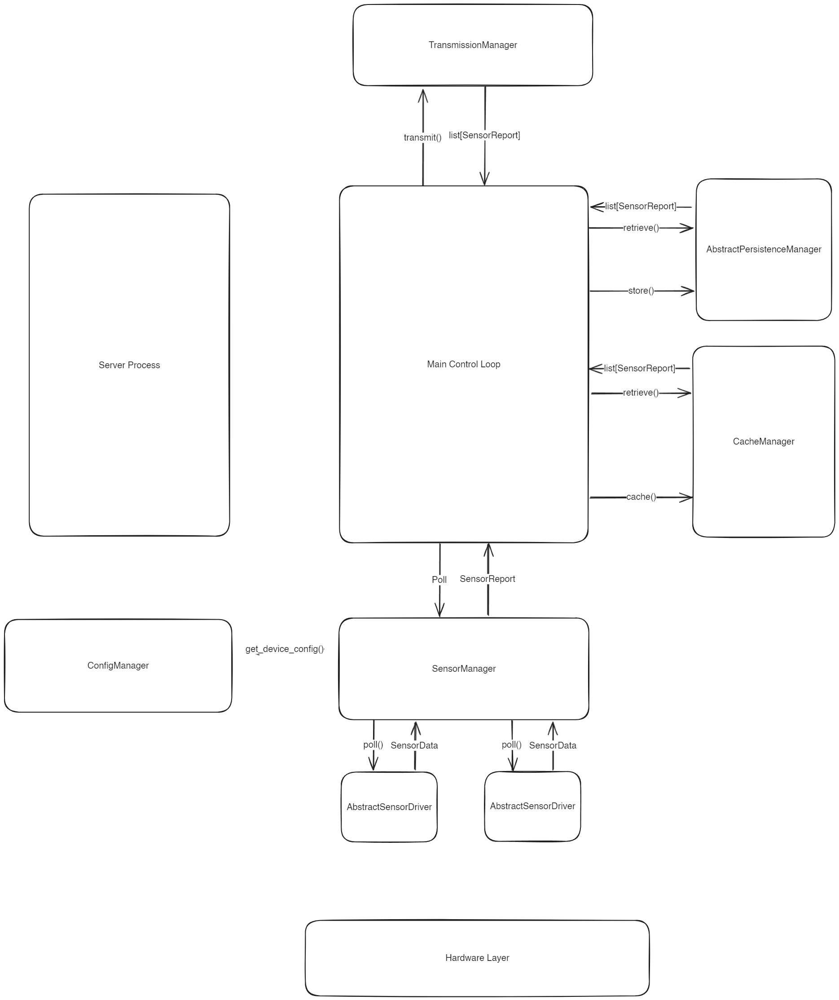

# Preliminary Software Design Document

This is the first software design document that is trying to establish what Python modules will be required and how they will interact with eachother. To start with, here is a brief overview of a principal used for design.

## Abstract Interfaces

In software engineering, an interface is a piece of code that contains only specification. For example, a function may define the arguments it accepts, the type of value it returns, and have a documentation string, but the actual workings of the function are left blank. The advantage of using interfaces is that it allows seperate pieces of software to be agnostic to specific implementations of the code they depend on, by making them depend on a contract instead. This allows changing those pieces independently. If one piece of the software changes, the changes required to make the rest of the system interact with the new logic should be as limited as possible to the location of the relevant change.

Abstract classes may be implemented with Python's `abc` (abstract base class) or `Protocol` types.

## Manager/Driver Design Pattern

The design pattern in use here can be called the Manager/Driver pattern. In this pattern, manager classes are responsible for implementing the main logic of the program, with the core control loop having access to all the manager classes it needs to acomplish its tasks, and deferring most of the logic to them. Driver classes focus on  Manager classes focus more on high-level orchestration logic such as coordinating tasks whereas driver classes focus on low-level logic such as interfacing with hardware.

Manager classes may contain multiple driver classes which it uses to complete tasks. If required, the driver classes may be made to implement an abstract interface, such that the manager need not know the underlying workings of the driver. For example, the SensorManager class is what the main control loop of the program uses to retrieve sensor data. The SensorManager contains multiple SensorDriver classes, which each implement an AbstractSensorDriver interface. Because of this, if a new sensor is to be supported, this should not involve any changes to the SensorManager class, as it is only responsible for coordinating instances of classes which implement the AbstractSensorDriver interface. Therefore, only a new implementation of the AbstractSensorDriver interface would need to be created.

## Assumptions

Here are some assumptions currently used in the design:
- The storage nodes expose an API, and the collector nodes attempt to request this API, rather than the other way around.
- The collector nodes must hold onto data when connection to storage nodes is not able to be established, and this data must persist across power cycles (no data losses).
- The collector nodes must be configurable remotely and without manually editing a configuration file.

## Collector Node Design

This section goes over the software architecture of the collector node. A summary of this architecture is given in the following image.

### Classes

This section gives an overview of the components of the system.

#### Sensors

The `SensorManager` class is responsible for controlling each `SensorDriver` class it is connected to, and constructing a `SensorReport` object. This will involve the following methods:
- `SensorManager.init()`: Given a `CollectorConfig` object, initializes a `SensorDriver` class for every sensor in the config. There will be a lookup table mapping types of sensor configurations to implementations of the `AbstractSensorDriver` interface which the `SensorManager` can use.
- `SensorManager.poll()`: Calls the `poll()` method on each of the underlying drivers, retrieving the data, catching and exceptions, and constructing a `SensorReport` object to return to the main control loop.

The `AbstractSensorDriver` class is resposible for collecting data from the hardware and will contain the following methods:
- `SensorDriver.init()`: Given a `SensorConfig` object, initializes any underlying library with the configured values.
- `SensorDriver.poll()`: Calls the underlying sensor library to return a `SensorData` object.

#### Data Caching

Data caching is necessary to allow for the `POLLING_INTERVAL` and the `TRANSMISSION_INTERVAL` to be different values. If this is not required, this class may be unnecessary.

This class will simply have two methods which stores and retrieves any given data in-memory as an attribute on the class.
- `CacheManager.cache()`: Stores the data in-memory.
- `CacheManager.retrieve()`: Retrieves the data.

#### Data Persistence

In order to avoid lost data when a connection to a target storage node is lost, data will have to be stored in the file system or some other persistent mechanism. The `AbstractPersistenceManager` class contains two methods which stores and retrieves any data necessary. The implementation may use a file system or a simple in-memory database.
- `CacheManager.store()`: Persists the data.
- `CacheManager.retrieve()`: Retrieves the data.

#### Data Transmission

The `AbstractTransmissionManager` class is an interface the main control loop can use to transmit data to the target storage nodes. The implementation may use a library such as `requests`.
- `AbstractTransmissionManager.transmit()`: For every target storage node configured, sends all `SensorRecord` objects. When a transmission is successful, removes the ID of that target node from the `SensorRecord`. Returns all `SensorRecord` objects which have unsent targets.

#### Configuration

The `ConfigManager` serves to make changes to the configuration file in a consistent way. If the configuration file is updated manually, there is no way to enforce constraints, such as GPIO pin numbers being correct.
- `ConfigManager.add_sensor()`: Adds a `SensorConfig` to the configuration file.
- `ConfigManager.update_sensor()`: Updates a `SensorConfig` in the configuration file.
- `ConfigManager.delete_sensor()`: Removes a `SensorConfig` from the configuration file.
- `ConfigManager.add_target()`: Adds a `TargetConfig` to the configuration file.
- `ConfigManager.update_target()`: Updates a `TargetConfig` in the configuration file.
- `ConfigManager.remove_target()`: Adds a `TargetConfig` from the configuration file.

### Data Structures

This section outlines the data structures that will need to be used and passed around the various components.

#### Sensor Data

These datastructures may utilize Python's dataclasses.

`SensorData`: Generic data type for data returned by a sensor. May just be an alias for `Dict[str, Any]`.
`SensorRecord`: Contains a `SensorData`, the ID of the associated sensor, and a `datetime` timestamp.
`SensorError`: Contains an error code, an error message, the ID of the associated sensor, and a `datetime` timestamp.
`SensorReport`: Contains a list of `SensorRecord`, a list of `SensorError`, the ID of the collector node, and a list of target storage node IDs the data has yet to be sent to.

#### Configuration Data

These datastructures may utilize the Pydantic library to make declarative validation easy. 

`SensorConfig`: Contains an enumerated value describing the type of sensor, a sensor ID, and a dictionary containing any device-specific configuration values, such as GPIO pins and settings passed into the underlying sensor library.
`TargetConfig`: Contains an ID of a storage node that data is to be sent to, and an endpoint where the data can be sent over the network.
`CollectorConfig`: Contains a list of `SensorConfig`, a list of `TargetConfig`, and a collector node ID.

### Program Logic

There will likely be two processes/threads required to run the collector node. The first is the main control loop, which is responsible for collecting and transmitting sensor data. The Startup, Polling, and Transmission sections cover this. The second is some sort of web server available for receiving requests. This is necessary to allow the collector node to be configured remotely and without manually changing the configuration values, such as adding new sensors without having them hard-coded into the program. If it would be possible to do this within the main control loop, that may be preferred, and if remotely changing the configuration without manually changing the configuration file is not necessary, this may not be required.  

#### Startup

Upon program startup, the main control loop does the following:
1. Instances of all required Manager classes are created.
2. The `SensorManager` retrieves the device configuration by calling `ConfigManager.get_device_config()`. This configuration data contains all sensors that are currently configured on the device. For each sensor, the `SensorManager` initializes the corresponding `SensorDriver` class.

#### Polling

On an interval known as `POLLING_INTERVAL`, the following occurs:
1. The main control loop calls `SensorManager.poll()` which in turn calls `AbstractSensorDriver.poll()` on all the `SensorDrivers`. Each `SensorDriver` may return a `SensorData`, or it may raise an exception if an error has occurred. If it raises an exception, the `SensorManager` catches it and creates a `SensorError` object. If it returns data, the `SensorManager` creates a `SensorRecord`.
2. The `SensorManager` creater a `SensorReport` object with the `SensorRecord` and `SensorError` objects, and populates it with the list of target storage node IDs that the device is to send data to. This is to allow the device to keep track of which of its targets it has sent data to, in the case that data is attempted to be sent when some connections are offline.
3. Finally, the `SensorManager` returns the `SensorReport` object to the main control loop, which then calls `CacheManager.cache()` which stores the data in-memory. This temporary storage allows `POLLING_INTERVAL` to be faster than `TRANSMISSION_INTERVAL`.

#### Transmission

On an interval known as `TRANSMISSION_INTERVAL`, the following occurs:
1. All available data from the `CacheManager` and `PersistenceManager` is retrieved.
2. All the data is attempted to be transmitted to all storage node targets by calling `TransmissionManager.transmit()`. When the `TransmissionManager` is successfully able to transmit a `SensorReport`, it removes the ID of the target node that the data was sent to on the `SensorReport`.
3. All `SensorReports` with unsent targets are returned to the main control loop. The main control loop stores the unsent data back into the `PersistenceManager`. This allows keeping data around which is unable to be sent for when the connection to the storage node is restored.

#### Requests

The collector node must be able to respond to outside requests for configuration purposes, and to expose a status indication. Otherwise, the only way to configure the node would be to manually edit the configuration file. If this does not need to be done remotely, then this section may be unnecessary.

If it is necessary, the following functions will be supported:
1. Editing the configuration file through the `ConfigManager`.
2. Accessing the status of the collector node, including any errors it has encountered that it wasn't able to send to its target storage nodes.
3. Force a power cycle.

While this interface may involve a simple REST API, a simple browser interface could be made to allow for easy configuration.

## Storage Node Design

TODO
